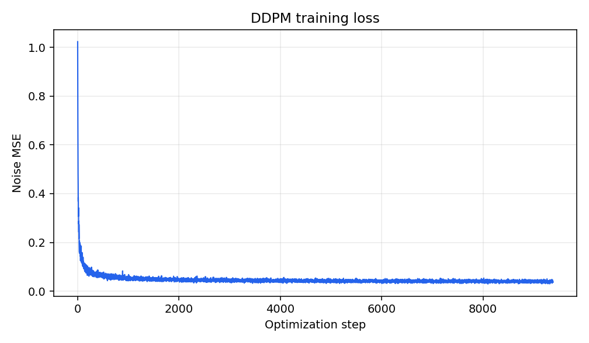
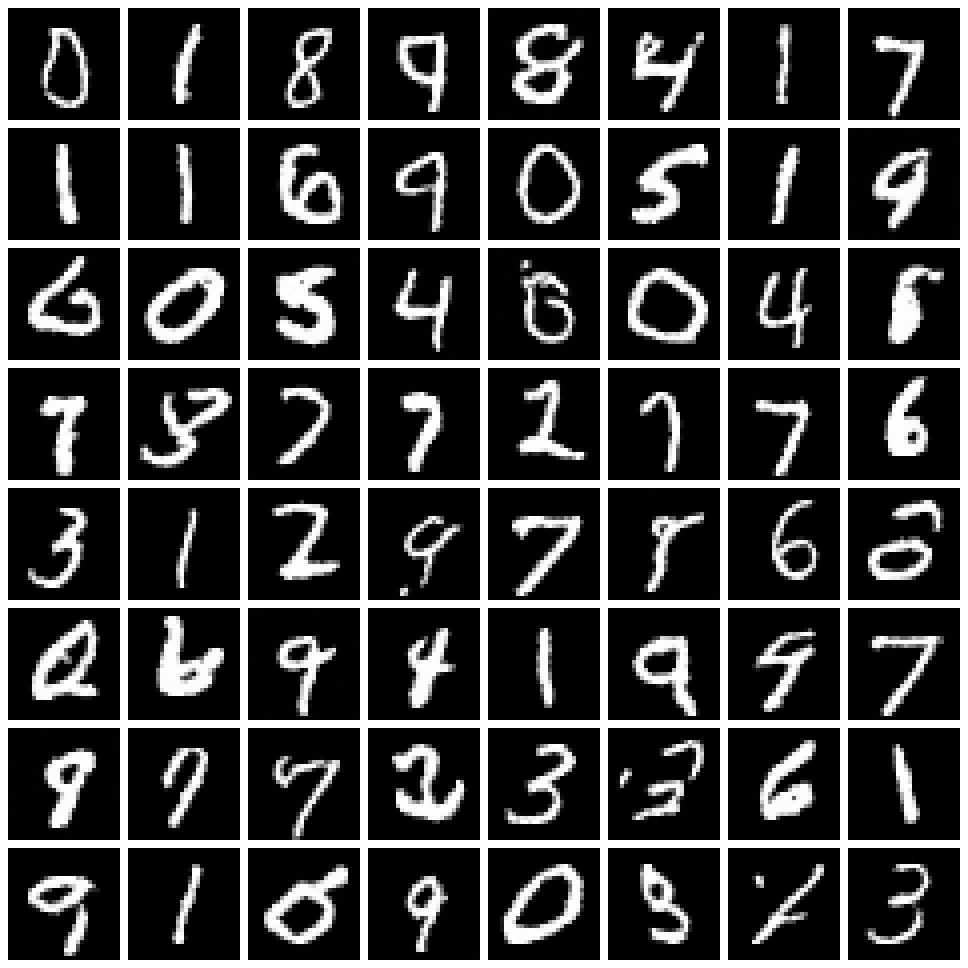
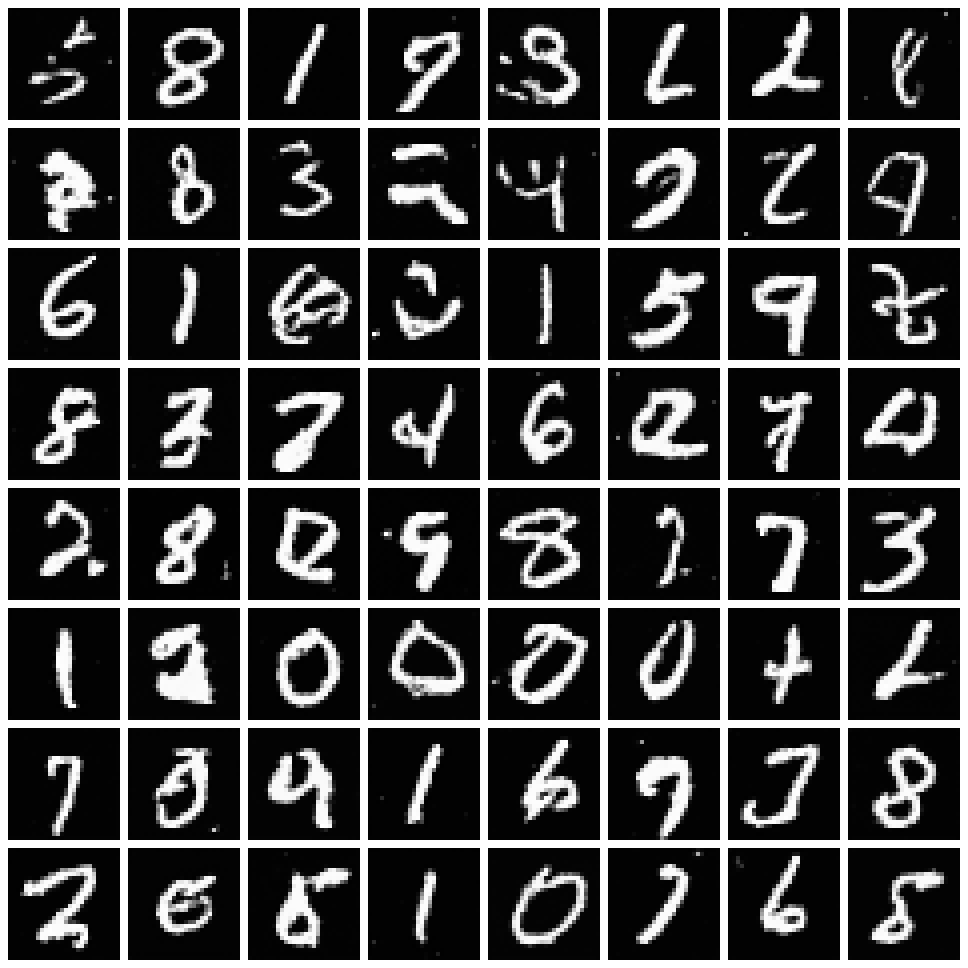
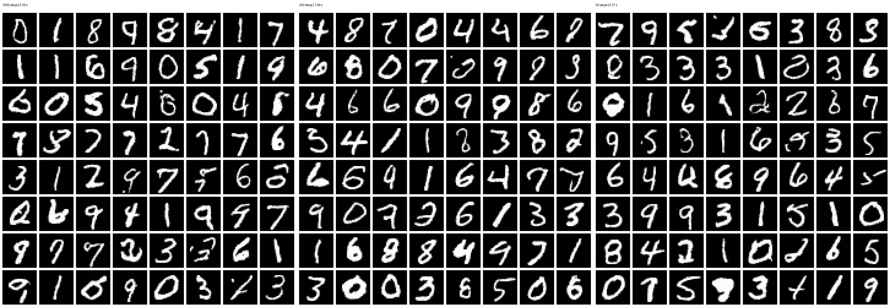
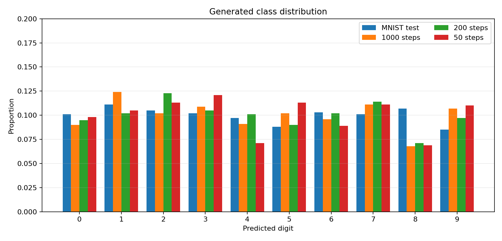

# MNIST DDPM 实验报告

## 1. 实验概述

本实验在 MNIST 数据集上从零实现去噪扩散概率模型（Denoising Diffusion Probabilistic Model, DDPM）。实验目标是完成前向加噪、时间条件噪声预测网络、EMA 训练和反向采样，并在同一模型上比较 1000、200、50 个反向步的生成质量与运行速度。最终模型包含 1,155,265 个参数，低于实验规定的 5M 参数上限。

## 2. 方法简述

### 2.1 前向扩散与训练目标

令每一步的保留系数及其累乘为：

$$
\alpha_t = 1 - \beta_t, \qquad \bar{\alpha}_t = \prod_{i=1}^{t}\alpha_i
$$

给定干净样本 x0，任意时刻的前向扩散分布可以直接写为：

$$
q(\mathbf{x}_t \mid \mathbf{x}_0) = \mathcal{N}\!\left(\sqrt{\bar{\alpha}_t}\,\mathbf{x}_0,\left(1-\bar{\alpha}_t\right)\mathbf{I}\right)
$$

通过重参数化，可以一次得到带噪样本，而不必从第 1 步逐次加噪：

$$
\mathbf{x}_t = \sqrt{\bar{\alpha}_t}\,\mathbf{x}_0 + \sqrt{1-\bar{\alpha}_t}\,\boldsymbol{\epsilon}, \qquad \boldsymbol{\epsilon}\sim\mathcal{N}(\mathbf{0},\mathbf{I})
$$

本实验采用 cosine beta schedule。网络 epsilon_theta(x_t,t) 预测实际加入的噪声，并最小化简化的均方误差目标：

$$
\mathcal{L}_{\mathrm{simple}}(\theta) = \mathbb{E}_{t,\mathbf{x}_0,\boldsymbol{\epsilon}}\!\left[\left\|\boldsymbol{\epsilon}-\boldsymbol{\epsilon}_\theta(\mathbf{x}_t,t)\right\|_2^2\right]
$$

### 2.2 噪声预测网络

模型为两级 MiniUNet。输入图像大小为 1x28x28，编码器通道依次为 32、64，7x7 瓶颈将通道提升到 128，并加入单头空间自注意力；解码器通过转置卷积恢复到 28x28，并与编码器的 14x14 和 28x28 特征进行跳跃连接。正弦时间嵌入经过两层 MLP 得到 128 维向量并注入所有 ResBlock。每个 ResBlock 使用 GroupNorm、SiLU、3x3 卷积和残差连接。训练期间维护衰减率为 0.999 的 EMA 权重，采样时默认使用 EMA 模型。

### 2.3 反向采样

生成从标准高斯噪声 `x_T` 开始。每一步先利用网络预测噪声，再估计 `x_0`，最后依据当前 `alpha_bar_t` 和下一采样时刻 `alpha_bar_s` 构造反向高斯分布。1000 步使用完整时间轴；200 步和 50 步使用均匀重采样的时间轴及广义 ancestral posterior，因此不需要重新训练模型。项目还实现了 `eta=0` 的 DDIM 作为扩展对照。

## 3. 实验设置

| 项目 | 配置 |
|---|---|
| 数据集 | MNIST 训练集，60,000 张 28x28 灰度图像 |
| 数据范围 | 从 [0,1] 归一化到 [-1,1] |
| 硬件 | NVIDIA GeForce RTX 4050 Laptop GPU，6 GB |
| 软件环境 | Python 3.11.16，PyTorch 2.5.1+cu124 |
| 模型 | MiniUNet，base channels=32，time dim=128 |
| 扩散设置 | T=1000，cosine schedule，预测 epsilon |
| 优化器 | AdamW，learning rate=2e-4 |
| 训练设置 | batch size=128，20 epochs，gradient clip=1.0 |
| 稳定化 | EMA=0.999，CUDA AMP，seed=42 |
| 对比设置 | 64 个样本，seed=123，共享初始噪声 |
| 定量评估 | 每种步数 1,000 个样本，独立 MNIST CNN，128 维特征 |

完整训练共执行 9,380 个优化步，GPU 训练耗时 361.85 秒。采样对比统一使用同一个 checkpoint 和 EMA 权重。

## 4. 损失曲线

图 1 记录了完整 20 个 epoch、9,380 个优化步的噪声预测损失变化。

第 1 个 epoch 的平均噪声预测 MSE 为 0.11124，第 20 个 epoch 降至 0.03945，下降约 64.5%。最终 batch MSE 为 0.03696，最后 10 个 batch 的平均值为 0.03969。曲线在前约 2,000 个优化步下降最快，之后缓慢收敛并围绕 0.04 波动。后期波动来自随机时间步、随机噪声和 mini-batch 差异，整体没有持续上升或数值发散，说明 AMP、梯度裁剪和当前学习率组合能够稳定训练。

## 5. 样本网格

### 5.1 1000 步 DDPM

1000 步结果覆盖 0 到 9 的多种数字和书写风格，大部分样本轮廓完整、前景与背景分离明显。少数样本仍存在笔画连接不自然或类别含混，说明小模型和有限训练轮数尚未完全拟合所有书写模式，但整体已经具备明确的数字生成能力。

### 5.2 50 步 DDIM 扩展

DDIM 在不重新训练的情况下可以进行确定性快速采样。当前 50 步结果包含可辨识数字，但断笔、重影和形状畸变多于 ancestral 50 步，表明同一噪声预测器在当前训练量和时间步选择下更适合 ancestral 采样路径。

## 6. 步数对比分析

下面使用同一 checkpoint、EMA 权重和初始噪声，对三种 ancestral 采样步数进行统一比较。

| 步数 | 总耗时/s | 相对加速 | 单步耗时/ms | Sharpness | Diversity | 前景占比 |
|---:|---:|---:|---:|---:|---:|---:|
| 1000 | 5.291 | 1.00x | 5.291 | 0.06445 | 0.18198 | 0.12512 |
| 200 | 1.063 | 4.98x | 5.316 | 0.06748 | 0.18190 | 0.13716 |
| 50 | 0.274 | 19.28x | 5.490 | 0.06538 | 0.17960 | 0.12984 |

三组实验使用相同的初始高斯噪声，模型也在计时前完成 CUDA 预热。单步耗时稳定在 5.3 到 5.5 ms，因此总耗时基本随网络前向次数线性变化。

- 1000 步是质量基准，数字轮廓整体最稳定，但总耗时最高。
- 200 步将采样时间缩短到 1.063 秒，获得 4.98 倍加速。Sharpness 和 Diversity 与 1000 步几乎一致，网格中的数字也保持清晰，是本实验推荐的质量-速度折中。
- 50 步仅需 0.274 秒，达到 19.28 倍加速。多数数字仍能辨识，但粗笔画、断笔和类别含混的样本有所增加。

Sharpness、Diversity 和前景占比是不依赖额外分类器的代理指标，只能描述边缘强度、批内差异和前景面积，不能直接代表数字语义正确率。因此本实验同时使用数值指标和网格人工观察。另一个限制是 ancestral sampling 会在每个反向步注入新噪声：共享初始噪声能够控制主要随机来源，但单个网格位置仍不是严格配对样本。

### 6.1 分类器辅助的定量评估

为更直接地衡量数字是否可辨识、类别是否齐全，本实验额外训练了一个与生成模型独立的 MNIST CNN。该分类器在完整 10,000 张测试图像上的准确率为 98.86%，因此可作为本实验内部的语义评估器。评估时，每种步数都用 seed=123 生成 1,000 张图像，并计算以下指标：

- **平均置信度**：分类器对预测类别给出的最大概率，越高表示数字通常越明确；
- **低置信比例**：最大概率小于 0.8 的样本比例，越低越好；
- **类别覆盖与归一化熵**：反映是否覆盖 0–9 以及分布是否均衡，覆盖和熵越高越好；
- **类别分布 TVD**：生成类别分布与真实测试子集分布的总变差距离，越低越好；
- **MNIST 特征 FID**：在分类器的 128 维特征空间中比较真实与生成分布的 Fréchet 距离，越低越好。

| 步数 | 耗时/s | 吞吐量/张·s⁻¹ | MNIST 特征 FID↓ | 平均置信度↑ | 低置信比例↓ | 类别覆盖↑ | 类别熵↑ | TVD↓ |
|---:|---:|---:|---:|---:|---:|---:|---:|---:|
| 1000 | 74.344 | 13.45 | **20.98** | 93.70% | 12.6% | 10/10 | 0.9953 | 0.066 |
| 200 | 15.011 | 66.62 | 22.73 | **94.06%** | **11.5%** | 10/10 | **0.9961** | **0.052** |
| 50 | 3.759 | **266.02** | 22.75 | 93.22% | 14.0% | 10/10 | 0.9932 | 0.087 |

1000 步取得最低 MNIST 特征 FID，说明其整体特征分布最接近真实图像。200 步的 FID 只增加 1.75，但平均置信度最高、低置信样本最少，类别熵最高且 TVD 最低；同时吞吐量约为 1000 步的 4.95 倍。这组结果进一步支持把 200 步作为展示和日常生成的推荐配置。50 步吞吐量约提高到 19.78 倍，但低置信比例升至 14.0%、TVD 升至 0.087，与网格中含混和畸形笔画增多的观察一致。

需要强调，MNIST 特征 FID 使用本实验分类器而不是 ImageNet Inception 网络，因此只能在本项目的相同评估器、相同样本规模下横向比较，不能与其他论文报告的标准 FID 数值直接比较。每组 1,000 个样本也仍存在抽样波动；更严格的实验可以增加样本量并报告多个随机种子的均值和标准差。

## 7. 遇到的实际工程问题与解决

### 7.1 Conda 环境最初安装到 CPU 版 PyTorch

**现象：** 电脑有 NVIDIA GPU，但 `torch.cuda.is_available()` 返回 False，训练无法使用 RTX 4050。
**原因与解决：** 默认软件源没有保证安装 CUDA wheel。项目新建独立环境 `assignment2-ddpm`，在 `requirements.txt` 中指定 PyTorch CUDA 12.4 wheel 索引并锁定 `torch==2.5.1+cu124`。安装后同时检查 PyTorch 版本、CUDA 可用状态和显卡名称，避免只根据安装成功信息判断。

### 7.2 W&B 登录提示 API key 长度错误

**现象：** `wandb login` 反复提示输入内容为 86 或 172 个字符，而当时的客户端期望 40 个字符。
**原因与解决：** 粘贴内容包含了授权页面链接、重复 token 或额外字符，而不是单独的 API key。处理时只复制 W&B authorize 页面显示的 token，重新执行登录，并将 SDK 固定为项目验证过的 `wandb==0.22.3`。密钥只保存在本机凭据中，不写入命令脚本、README 或 Git。

### 7.3 Windows 普通用户无法创建 W&B 符号链接

**现象：** 使用 `wandb.Run.save()` 保存结果时，Windows 因缺少创建符号链接权限而失败。
**原因与解决：** 普通用户通常没有 `SeCreateSymbolicLinkPrivilege`。训练代码改为通过 `wandb.Image` 上传预览图和损失曲线的文件副本，不再依赖管理员权限或开发者模式，也避免了改变系统安全设置。

### 7.4 训练被停止后需要继续，而不能从头开始

**现象：** 长时间训练可能被手动中断；只保存模型权重无法无缝恢复优化过程和 W&B 曲线。
**原因与解决：** 捕获 `KeyboardInterrupt` 并保存 `checkpoint_interrupted.pt`。checkpoint 同时包含原始模型、EMA 模型、优化器、AMP GradScaler、epoch、global step、历史损失、模型配置和 W&B run ID。恢复时先校验模型及扩散配置，再用 `--resume` 接续训练和原 W&B run。

### 7.5 非相邻采样步不能直接套用一步 posterior

**现象：** 将 1000 步简单抽成 200 或 50 步后，如果仍使用相邻时刻公式，均值与方差不再对应实际的 t 到 s 跳转。
**原因与解决：** 根据 `alpha_bar_t` 和 `alpha_bar_s` 推导有效 alpha、beta 和 posterior variance，在重采样时间轴上实现广义 ancestral transition。计时脚本还加入 CUDA 预热、固定 seed 和共享初始噪声，使速度与质量对比更稳定。

### 7.6 PyTorch 与 torchvision 二进制版本可能不匹配

**现象：** 在独立 CUDA 环境中额外安装 torchvision 容易引入版本或算子不匹配，而实验只需要 MNIST 基本读取能力。
**原因与解决：** 数据模块直接下载官方 gzip IDX 文件，执行 MD5 校验并自行解析图像和标签；图片网格也由 Pillow 实现。这样减少了一个大型二进制依赖，并让数据处理流程更透明、可复现。

## 8. 结论

本实验完成了一个可训练、可恢复、可观测和可复现的 MNIST DDPM 工程。1.16M 参数的 MiniUNet 在 RTX 4050 Laptop GPU 上约 6 分钟完成 20 个 epoch，噪声预测损失稳定收敛，并能够生成多样的手写数字。采样实验表明，200 步在 64 样本基准中比 1000 步快 4.98 倍；在进一步的 1,000 样本评估中，三组均覆盖全部 10 类，200 步获得最高平均置信度 94.06%、最低低置信比例 11.5% 和最低类别分布 TVD 0.052。1000 步的 MNIST 特征 FID 最低，50 步速度最快但含混样本更多。因此，1000 步适合作为质量基准，200 步 ancestral sampling 更适合作为日常生成与现场展示配置。

## 参考资料

- [Denoising Diffusion Probabilistic Models](https://arxiv.org/abs/2006.11239)
- [Improved Denoising Diffusion Probabilistic Models](https://proceedings.mlr.press/v139/nichol21a.html)
- [Denoising Diffusion Implicit Models](https://arxiv.org/abs/2010.02502)
- [GANs Trained by a Two Time-Scale Update Rule Converge to a Local Nash Equilibrium（FID）](https://proceedings.neurips.cc/paper_files/paper/2017/hash/8a1d694707eb0fefe65871369074926d-Abstract.html)
