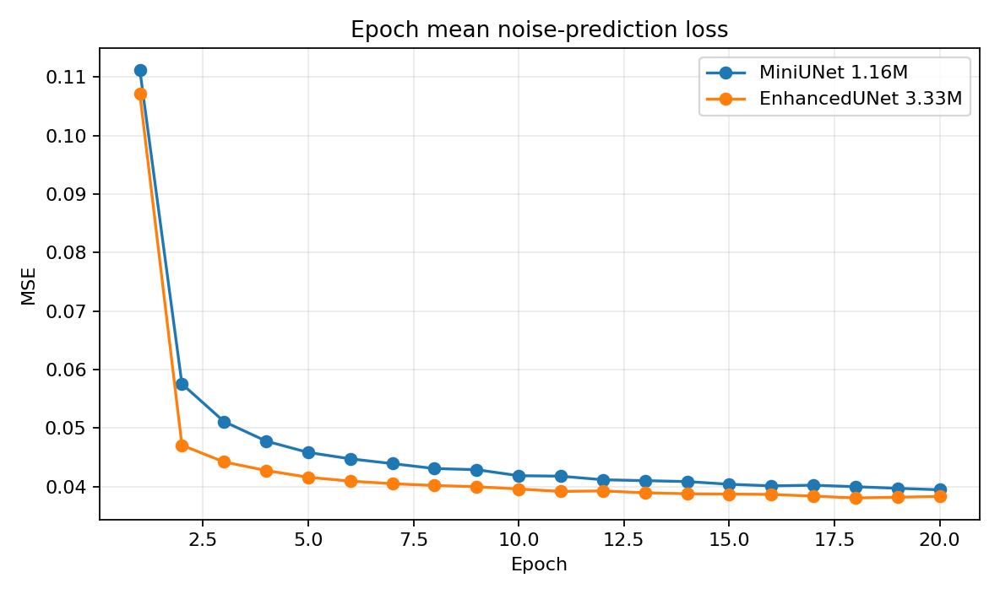
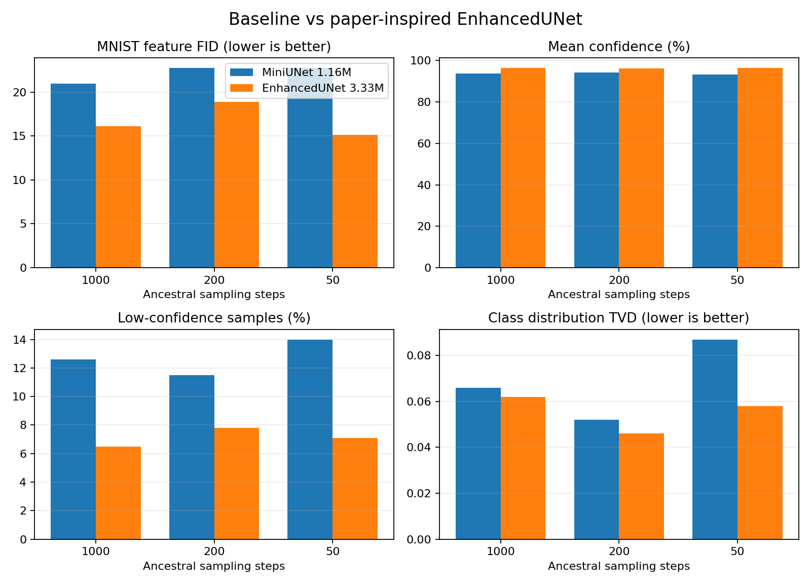
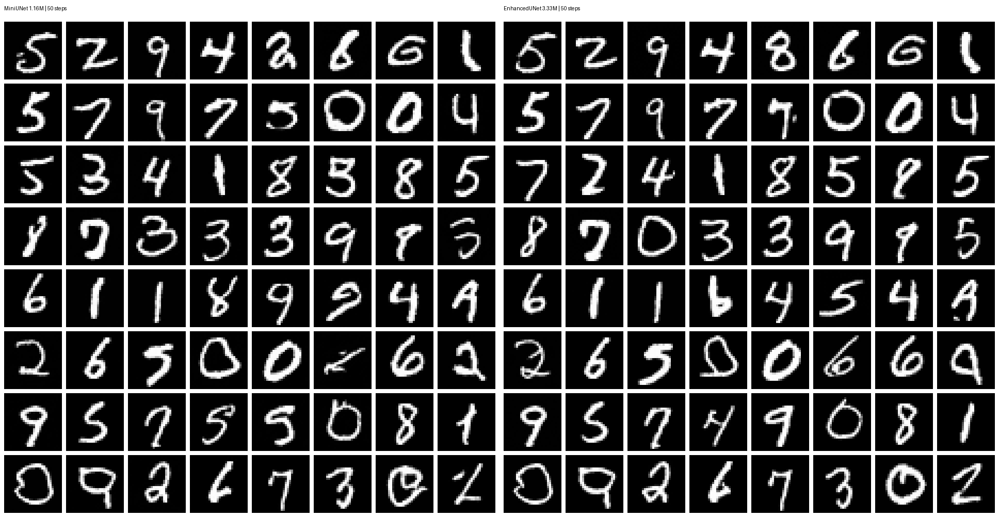

# MNIST DDPM 实验报告

## 1. 实验目的与实验划分

本实验在 MNIST 数据集上从零实现去噪扩散概率模型（Denoising Diffusion Probabilistic Model, DDPM），完成前向加噪、时间条件噪声预测、EMA 训练、反向采样与定量评估。实验分为两个相互独立、目标不同的阶段：

| 实验 | 研究问题 | 模型 | 参数量 | 主要输出目录 |
|---|---|---:|---:|---|
| **实验一：基线与步数对比** | 一个轻量 DDPM 能否生成数字？减少采样步数会带来怎样的质量—速度权衡？ | MiniUNet | 1,155,265 | `outputs/train_full`、`outputs/comparison`、`outputs/evaluation` |
| **实验二：论文启发的架构改进** | 在训练设置不变且参数量低于 5M 时，AdaGN、多尺度注意力和更深残差结构能否提升质量？ | EnhancedUNet | 3,327,553 | `outputs/train_enhanced`、`outputs/evaluation_enhanced`、`outputs/model_comparison` |

实验二使用新的随机初始化从头训练，**没有在实验一 checkpoint 上继续训练**。两次实验复用相同的数据、扩散过程、优化器、训练轮数、随机种子和评估器，从而使模型结构成为主要变量。

## 2. 两次实验共用的方法

### 2.1 前向扩散

令每一步的噪声方差为 $\beta_t$，信号保留系数及其累乘为：

$$
\alpha_t = 1 - \beta_t,
\qquad
\bar{\alpha}_t = \prod_{i=1}^{t}\alpha_i.
$$

给定干净图像 $\mathbf{x}_0$，任意时刻 $t$ 的带噪图像可以直接采样：

$$
q(\mathbf{x}_t \mid \mathbf{x}_0)
=
\mathcal{N}\!\left(
\sqrt{\bar{\alpha}_t}\,\mathbf{x}_0,
(1-\bar{\alpha}_t)\mathbf{I}
\right),
$$

$$
\mathbf{x}_t
=
\sqrt{\bar{\alpha}_t}\,\mathbf{x}_0
+
\sqrt{1-\bar{\alpha}_t}\,\boldsymbol{\epsilon},
\qquad
\boldsymbol{\epsilon}\sim\mathcal{N}(\mathbf{0},\mathbf{I}).
$$

本实验采用 cosine schedule，共设 $T=1000$ 个扩散时间步。

### 2.2 噪声预测与训练目标

网络 $\boldsymbol{\epsilon}_\theta(\mathbf{x}_t,t)$ 接收带噪图像和时间步，预测加入图像的标准高斯噪声。训练目标是简化均方误差：

$$
\mathcal{L}_{\mathrm{simple}}(\theta)
=
\mathbb{E}_{t,\mathbf{x}_0,\boldsymbol{\epsilon}}
\left[
\left\|
\boldsymbol{\epsilon}
-
\boldsymbol{\epsilon}_\theta(\mathbf{x}_t,t)
\right\|_2^2
\right].
$$

训练期间维护衰减率为 0.999 的指数移动平均（EMA）权重，采样和评估默认使用 EMA 模型。

### 2.3 反向采样

生成从标准高斯噪声 $\mathbf{x}_T$ 开始。模型先由当前状态估计干净图像：

$$
\hat{\mathbf{x}}_0
=
\frac{
\mathbf{x}_t-
\sqrt{1-\bar{\alpha}_t}\,
\boldsymbol{\epsilon}_\theta(\mathbf{x}_t,t)
}{
\sqrt{\bar{\alpha}_t}
}.
$$

随后根据 $\bar{\alpha}_t$ 与下一采样时刻 $\bar{\alpha}_s$ 构造 $t\to s$ 的反向高斯转移。1000 步使用完整时间轴；200 步与 50 步使用均匀重采样时间轴和广义 ancestral posterior，因此不需要重新训练。项目也实现了 $\eta=0$ 的 DDIM 作为扩展采样方式。

### 2.4 统一评估方法

两次实验复用同一个独立 MNIST CNN 评估器。该分类器在 10,000 张测试图像上的准确率为 98.86%。每个模型、每种步数均以 seed=123 生成 1,000 张图像，计算：

- **MNIST 特征 FID（越低越好）**：在分类器 128 维特征空间比较真实与生成分布的 Fréchet 距离；
- **平均置信度（越高越好）**：分类器对预测类别给出的最大概率的平均值；
- **低置信比例（越低越好）**：最大类别概率低于 0.8 的样本比例；
- **类别覆盖与归一化熵（越高越好）**：衡量是否覆盖 0–9 以及类别是否均衡；
- **TVD（越低越好）**：生成类别分布与真实测试子集类别分布的总变差距离。

这里的 FID 使用 MNIST 分类器而不是 ImageNet Inception，只适合在本项目相同评估器和样本规模下横向比较，不能与其他论文的标准 FID 直接比较。

## 3. 公共环境、设置与控制变量

| 项目 | 两次实验共同配置 |
|---|---|
| 数据集 | MNIST 训练集，60,000 张 28×28 灰度图像 |
| 数据处理 | 像素从 $[0,1]$ 归一化到 $[-1,1]$ |
| 硬件 | NVIDIA GeForce RTX 4050 Laptop GPU，6 GB |
| 软件环境 | Python 3.11.16，PyTorch 2.5.1+cu124 |
| 扩散设置 | $T=1000$，cosine schedule，预测 $\epsilon$ |
| 优化器 | AdamW，learning rate = $2\times10^{-4}$ |
| 训练设置 | batch size = 128，20 epochs，共 9,380 个优化步 |
| 稳定化 | EMA = 0.999，CUDA AMP，gradient clip = 1.0 |
| 训练随机种子 | 42 |
| 评估随机种子 | 123 |

两次实验的主要自变量是模型结构与容量。训练轮数没有按模型大小额外增加，评估阶段也没有为增强模型更换分类器或挑选更有利的随机种子。

## 4. 实验一：MiniUNet 基线与采样步数

### 4.1 实验目的与模型结构

实验一首先验证一个低于 5M 参数限制的轻量 DDPM 是否能从零学习 MNIST 分布，并研究在同一 checkpoint 下把反向过程从 1000 步压缩到 200 或 50 步后的质量—速度变化。

MiniUNet 使用 32→64→128 的通道层级。编码器在 28×28 和 14×14 各使用一个 ResBlock，7×7 瓶颈包含两个 ResBlock 和单头自注意力；解码器通过转置卷积上采样，并拼接对应编码器特征。128 维正弦时间嵌入经过 MLP 后，以加法方式注入每个 ResBlock。模型参数量为 1,155,265。

### 4.2 实验一训练结果

MiniUNet 在 20 个 epoch 内训练 9,380 步，GPU 耗时 361.85 秒。第 1 轮平均噪声预测 MSE 为 0.11124，第 20 轮降至 0.03945，下降约 64.5%；最终 batch MSE 为 0.03696，最后 10 个 batch 的平均值为 0.03969。曲线前约 2,000 步下降最快，后期围绕 0.04 波动，没有持续上升或数值发散。

### 4.3 实验一生成样本

1000 步结果覆盖多种数字和书写风格，大部分轮廓完整，说明轻量模型已经学习到 MNIST 的主要分布。少数样本仍有断笔、粘连或类别含混。

50 步 DDIM 无需重新训练即可确定性采样，但当前结果中的断笔、重影和畸变多于 ancestral 采样，说明该噪声预测器在当前训练量和时间步选择下更适合 ancestral 路径。

### 4.4 实验一步数对比：64 张快速基准

三组 ancestral 采样使用同一 checkpoint、EMA 权重、seed 和初始高斯噪声，并在计时前进行 CUDA 预热。

| 步数 | 总耗时/s | 相对加速 | 单步耗时/ms | Sharpness | Diversity | 前景占比 |
|---:|---:|---:|---:|---:|---:|---:|
| 1000 | 5.291 | 1.00× | 5.291 | 0.06445 | 0.18198 | 0.12512 |
| 200 | 1.063 | 4.98× | 5.316 | 0.06748 | 0.18190 | 0.13716 |
| 50 | 0.274 | 19.28× | 5.490 | 0.06538 | 0.17960 | 0.12984 |

单步耗时约为 5.3–5.5 ms，总耗时基本随网络前向次数线性变化。200 步把耗时缩短到 1.063 秒，同时代理指标和视觉清晰度接近 1000 步；50 步最快，但含混样本有所增加。Sharpness、Diversity 和前景占比不是语义指标，因此还需结合正式分类器评估。

### 4.5 实验一定量评估：每组 1,000 张

| 步数 | 耗时/s | 吞吐量/张·s⁻¹ | MNIST 特征 FID↓ | 平均置信度↑ | 低置信比例↓ | 类别覆盖↑ | 类别熵↑ | TVD↓ |
|---:|---:|---:|---:|---:|---:|---:|---:|---:|
| 1000 | 74.344 | 13.45 | **20.98** | 93.70% | 12.6% | 10/10 | 0.9953 | 0.066 |
| 200 | 15.011 | 66.62 | 22.73 | **94.06%** | **11.5%** | 10/10 | **0.9961** | **0.052** |
| 50 | 3.759 | **266.02** | 22.75 | 93.22% | 14.0% | 10/10 | 0.9932 | 0.087 |

1000 步获得最低 FID；200 步的 FID 仅增加 1.75，却取得最高置信度、最低低置信比例和最低 TVD，吞吐量约为 1000 步的 4.95 倍；50 步约快 19.78 倍，但低置信比例与类别偏移增加。因此，**实验一的结论是 200 步 ancestral 最适合作为 MiniUNet 的质量—速度折中**。

## 5. 实验二：论文启发的 EnhancedUNet

### 5.1 实验目的与独立训练说明

实验二针对实验一仍存在的含混数字与 FID 偏高问题，检验网络结构和容量是否限制生成质量。EnhancedUNet 参考 Dhariwal 与 Nichol 的扩散 U-Net 消融和 OpenAI `improved-diffusion` 实现，在 5M 参数以内引入结构改进。它使用随机初始化从头训练，输出保存在独立目录，未加载实验一模型权重。

### 5.2 增强模型架构与论文依据

EnhancedUNet 的输入输出仍为 1×28×28，但通道层级改为 48→96→192，时间特征维度改为 192。其完整数据流如下：

1. **时间分支**：时间步 $t$ 经 192 维正弦编码和两层 MLP，所得向量送入全部 AdaptiveResBlock；
2. **28×28 编码层**：输入卷积得到 48 通道，连续两个 AdaptiveResBlock 提取特征并保存 skip $S_1$；
3. **14×14 编码层**：下采样后由 48 通道扩展到 96 通道，连续两个 AdaptiveResBlock 后执行 4 头自注意力，并保存 skip $S_2$；
4. **7×7 瓶颈**：96→192 的 AdaptiveResBlock、4 头自注意力、192→192 的 AdaptiveResBlock；
5. **14×14 解码层**：上采样到 96 通道，与 $S_2$ 拼接后经过两个 AdaptiveResBlock 和 4 头自注意力；
6. **28×28 解码层**：上采样到 48 通道，与 $S_1$ 拼接后经过两个 AdaptiveResBlock；
7. **输出层**：GroupNorm、SiLU 和 3×3 卷积输出与输入同形状的预测噪声。

普通 MiniUNet 在 ResBlock 中把时间投影直接加到图像特征。EnhancedUNet 则让时间向量生成逐通道缩放和偏移，通过 Adaptive Group Normalization 调制归一化特征：

$$
\operatorname{AdaGN}(\mathbf{h},t)
=
\left(1+\mathbf{s}(t)\right)
\odot
\operatorname{GroupNorm}(\mathbf{h})
+
\mathbf{b}(t).
$$

其中 $\mathbf{s}(t),\mathbf{b}(t)\in\mathbb{R}^{C}$，扩展到空间维后作用于全部 $H\times W$ 位置。这使同一图像特征能够根据噪声等级改变通道响应，而不是仅接收一个加性偏置。

| 架构项目 | 实验一 MiniUNet | 实验二 EnhancedUNet |
|---|---|---|
| 参数量 | 1.16M | 3.33M（2.88×） |
| 基础通道 / 时间维度 | 32 / 128 | 48 / 192 |
| 时间融合 | 投影后直接相加 | AdaGN scale/shift |
| 每个 28×28、14×14 尺度的残差深度 | 1 个块 | 2 个块 |
| 注意力 | 7×7 单头 | 14×14 与 7×7，4 头 |
| 正则化 | 无 dropout | dropout = 0.1 |
| 初始化 | 默认初始化 | 残差末端、注意力投影和输出层零初始化 |

零初始化使新增残差与注意力分支在训练开始时近似恒等映射，有助于稳定更深网络。需要注意，本实验同时改变了通道数、条件注入、残差深度、注意力和初始化，因此结果证明的是**整套增强设计**有效，不能把全部增益单独归因于某一个组件；若要区分贡献，需要继续做消融实验。

### 5.3 实验二训练结果

EnhancedUNet 同样训练 20 个 epoch、9,380 步，耗时 991.92 秒。第 20 轮平均 MSE 为 0.03830，略低于 MiniUNet 的 0.03945；最终 batch MSE 为 0.03689，最后 10 个 batch 平均值为 0.03766。训练没有出现发散，但耗时为基线的 2.74 倍。

### 5.4 实验二生成质量与实验一对照

| 步数 | 实验一 FID | 实验二 FID | FID 降幅 | 实验一置信度 | 实验二置信度 | 实验一低置信 | 实验二低置信 | 实验二 TVD |
|---:|---:|---:|---:|---:|---:|---:|---:|---:|
| 1000 | 20.98 | **16.11** | 23.23% | 93.70% | **96.37%** | 12.6% | **6.5%** | 0.062 |
| 200 | 22.73 | **18.90** | 16.85% | 94.06% | **96.21%** | 11.5% | **7.8%** | **0.046** |
| 50 | 22.75 | **15.13** | 33.50% | 93.22% | **96.29%** | 14.0% | **7.1%** | 0.058 |

EnhancedUNet 在全部步数下均获得更低 FID、更高平均置信度和更低低置信比例。1000、200、50 步的 FID 分别下降 23.23%、16.85% 和 33.50%，低置信比例相对下降 48.41%、32.17% 和 49.29%。样本网格中增强模型的笔画通常更连续，含混样本更少。

### 5.5 实验二计算代价与局限

| 对比项 | 实验一 MiniUNet | 实验二 EnhancedUNet | 代价变化 |
|---|---:|---:|---:|
| 参数量 | 1.16M | 3.33M | 2.88× |
| 20 epochs 训练耗时 | 361.85 s | 991.92 s | 2.74× |
| 1000 步评估吞吐量 | 13.45 张/s | 3.16 张/s | 降至约 23.5% |
| 200 步评估吞吐量 | 66.62 张/s | 15.76 张/s | 降至约 23.7% |
| 50 步评估吞吐量 | 266.02 张/s | 59.33 张/s | 降至约 22.3% |

实验二说明在 5M 参数限制内进行论文启发的结构升级可以显著改善生成指标，但单步计算更贵。50 步 EnhancedUNet 在本次单一 seed、1,000 样本评估中得到最低 FID 15.13，不能据此断言“50 步普遍优于 1000 步”；更严格的结论需要多个随机种子并报告均值与标准差。

## 6. 遇到的实际工程问题与解决

### 6.1 Conda 环境最初安装到 CPU 版 PyTorch

**现象：** 电脑有 NVIDIA GPU，但 `torch.cuda.is_available()` 返回 False。

**原因与解决：** 默认软件源没有保证安装 CUDA wheel。项目建立独立环境 `assignment2-ddpm`，在 `requirements.txt` 中指定 PyTorch CUDA 12.4 wheel 索引并锁定 `torch==2.5.1+cu124`。安装后同时验证 PyTorch 版本、CUDA 状态和显卡名称。

### 6.2 W&B 登录提示 API key 长度错误

**现象：** `wandb login` 提示输入为 86 或 172 个字符，而客户端期望 40 个字符。

**原因与解决：** 粘贴了包含链接、重复 token 或额外字符的整段文本。正确方式是只复制 authorize 页面显示的 API key。密钥保存在本机凭据中，不写入脚本、README 或 Git。

### 6.3 Windows 普通用户无法创建 W&B 符号链接

**现象：** `wandb.Run.save()` 因缺少符号链接权限失败。

**解决：** 改用 `wandb.Image` 上传预览图和损失曲线文件，不依赖管理员权限或开发者模式。

### 6.4 中断后需要真正恢复训练

**现象：** 长训练可能被手动中断，仅保存模型权重不能恢复优化器、AMP 和曲线状态。

**解决：** 捕获 `KeyboardInterrupt` 并保存模型、EMA、优化器、GradScaler、epoch、global step、历史损失、模型配置和 W&B run ID。`--resume` 会先校验模型与扩散配置，再继续原训练过程。

### 6.5 非相邻采样步不能套用一步 posterior

**现象：** 将 1000 步简单抽成 200 或 50 步后，相邻时刻公式不再对应实际的 $t\to s$ 跳转。

**解决：** 根据 $\bar{\alpha}_t$ 和 $\bar{\alpha}_s$ 推导有效系数与 posterior variance，在重采样时间轴上实现广义 ancestral transition。

### 6.6 PyTorch 与 torchvision 二进制版本可能不匹配

**现象：** CUDA 环境中额外安装 torchvision 容易引入版本或算子不匹配。

**解决：** 数据模块直接下载官方 gzip IDX 文件、执行 MD5 校验并自行解析；图片网格由 Pillow 输出，减少大型二进制依赖。

### 6.7 两种模型的 checkpoint 兼容

**现象：** 采样入口若固定创建 MiniUNet，就无法加载 EnhancedUNet；旧 checkpoint 又没有模型类型字段。

**解决：** 增加统一 `build_model()` 工厂，新 checkpoint 保存 `model_name` 与构造参数；旧 checkpoint 默认回退到 `mini`。恢复训练会校验模型名称、模型配置和扩散配置，避免错误权重被静默加载。

## 7. 结论

**实验一结论：** 1.16M 参数 MiniUNet 在 RTX 4050 Laptop GPU 上约 6 分钟完成训练，能够生成覆盖 0–9 的多样数字。1000 步的 FID 最低，而 200 步在只损失少量 FID 的情况下获得约 4.95 倍吞吐量，并有更高置信度和更低 TVD，因此是基线模型的推荐配置。

**实验二结论：** 3.33M 参数 EnhancedUNet 在相同训练轮数和统一评估条件下，将三种步数的 FID 降低 16.85%–33.50%，并将低置信样本相对减少约三分之一到一半，证明结构与容量确实限制了实验一的生成质量。不过其训练耗时增加到 2.74 倍，采样吞吐量下降约 4.2–4.5 倍。

因此，MiniUNet 更适合快速调试和轻量展示；EnhancedUNet 更适合强调生成质量。若使用增强模型并希望控制等待时间，可优先展示 50 或 200 步结果。后续最有价值的工作是对 AdaGN、双残差块、多尺度注意力和通道扩展分别进行消融，并使用多个随机种子估计结果方差。

## 参考资料

- [Denoising Diffusion Probabilistic Models](https://arxiv.org/abs/2006.11239)
- [Improved Denoising Diffusion Probabilistic Models](https://proceedings.mlr.press/v139/nichol21a.html)
- [Denoising Diffusion Implicit Models](https://arxiv.org/abs/2010.02502)
- [Diffusion Models Beat GANs on Image Synthesis](https://proceedings.neurips.cc/paper/2021/hash/49ad23d1ec9fa4bd8d77d02681df5cfa-Abstract.html)
- [OpenAI improved-diffusion U-Net implementation](https://github.com/openai/improved-diffusion/blob/main/improved_diffusion/unet.py)
- [GANs Trained by a Two Time-Scale Update Rule Converge to a Local Nash Equilibrium（FID）](https://proceedings.neurips.cc/paper_files/paper/2017/hash/8a1d694707eb0fefe65871369074926d-Abstract.html)
