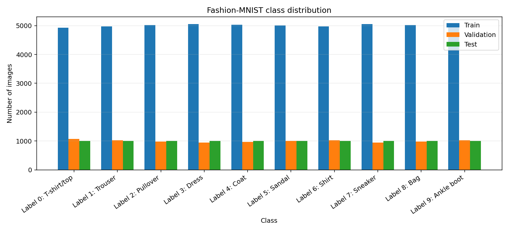
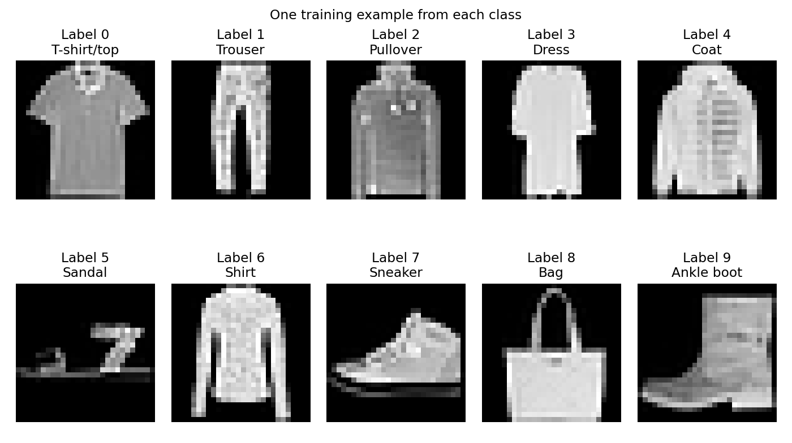
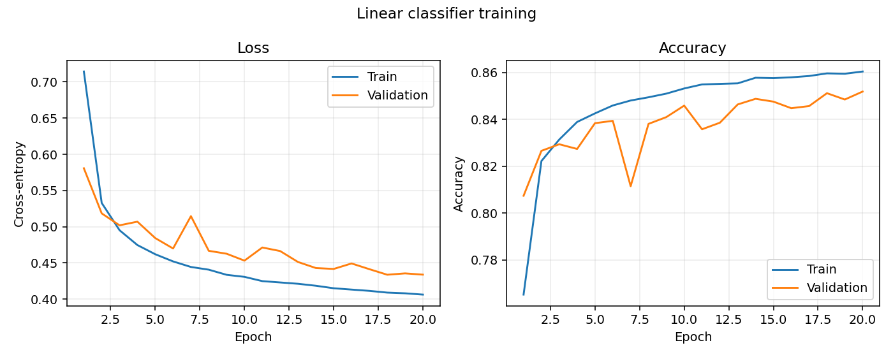
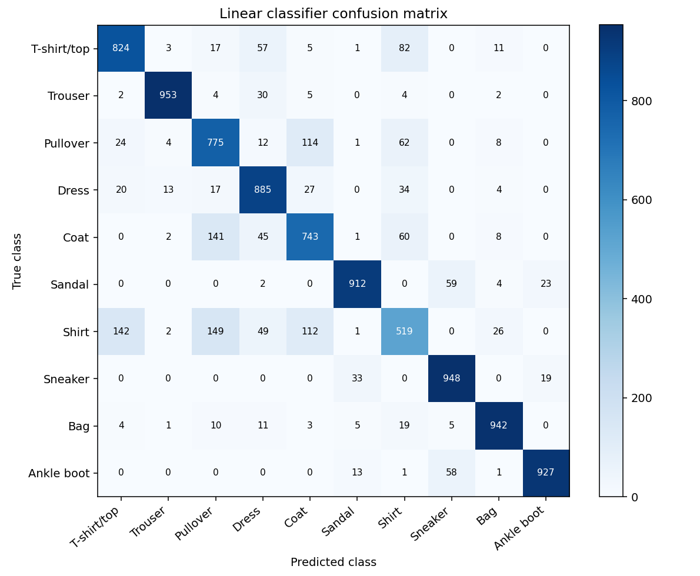
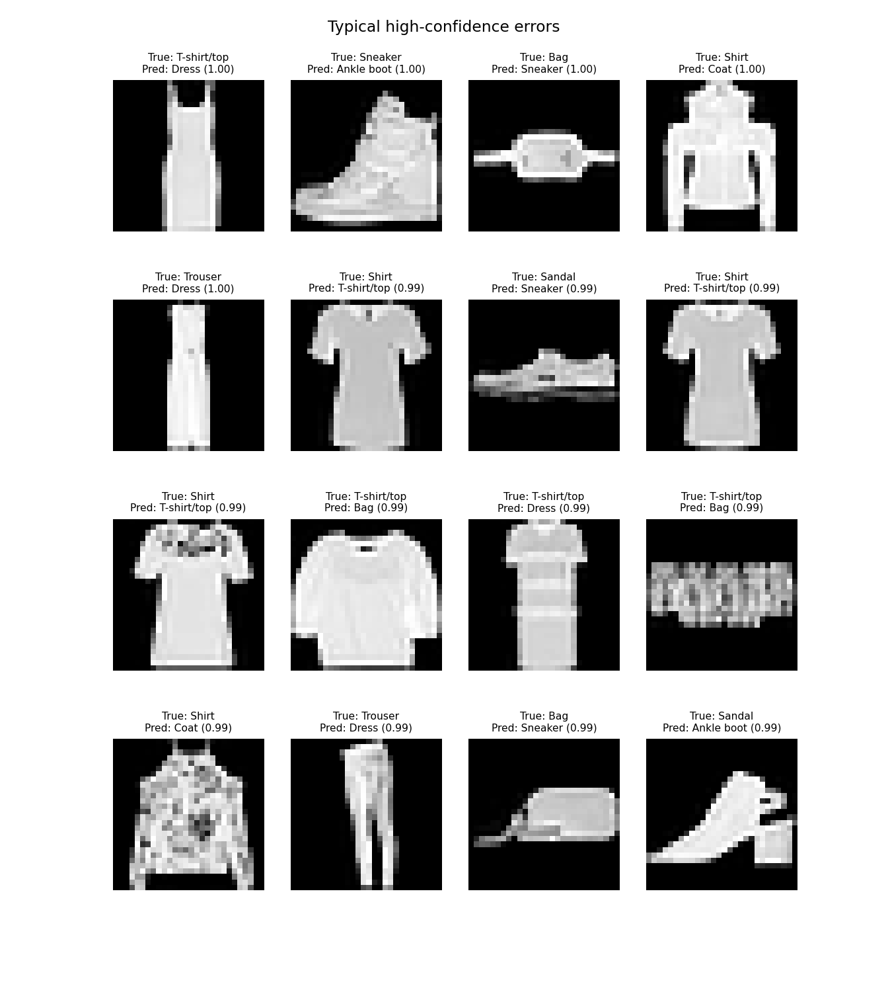
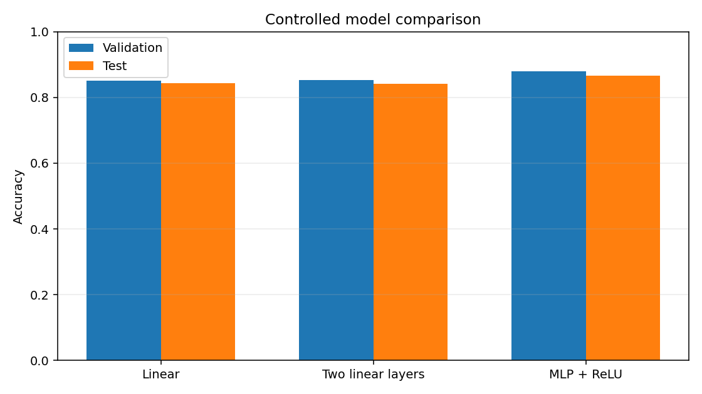
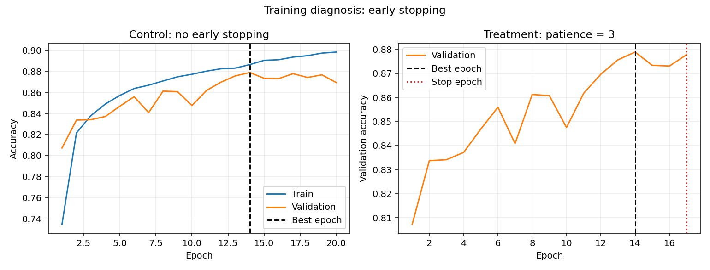

# Fashion-MNIST：从线性分类器到多层感知机

本项目完成 Fashion-MNIST 十分类实验，包括数据分析、线性 Softmax 基线、纯 NumPy 单隐藏层 MLP 梯度检查、三个 PyTorch 模型的受控比较，以及针对训练后期轻微过拟合的 Early Stopping 诊断。

## 1. 项目结构

```text
Assignment3/
├── config/
│   ├── config.json                 # 数据、训练、比较与诊断配置
│   └── metadata.json               # 类别名称及其官方来源
├── data/FashionMNIST/raw/          # 官方 IDX 压缩数据
├── src/
│   ├── __init__.py
│   ├── data.py                     # IDX 读取、固定划分与 DataLoader
│   ├── models.py                   # 三个 PyTorch 模型
│   ├── numpy_mlp.py                # NumPy forward、backward 与梯度检查
│   ├── training.py                 # 三模型共用训练代码
│   └── evaluation.py               # 准确率、混淆矩阵和逐类召回率
├── visualization/
│   ├── visualize_data.py           # 数据集统计与样例
│   ├── evaluation_plots.py         # 混淆矩阵、召回率和典型错误
│   ├── comparison_plots.py         # 三模型曲线与性能比较
│   └── diagnosis_plots.py          # Early Stopping 诊断图
├── train.py                        # 线性基线训练
├── evaluate.py                     # 线性基线最终测试评价
├── gradient_check.py               # NumPy MLP 梯度检查入口
├── compare_models.py               # 三模型受控比较
├── diagnose_training.py            # Early Stopping 单因素实验
├── outputs/                        # 已生成的实验结果
└── requirements.txt
```

## 2. 环境

本次实验使用：

- Windows
- Python 3.11.16
- PyTorch 2.5.1 + CUDA 12.4
- NumPy 1.26.4
- Matplotlib 3.9.2
- NVIDIA GeForce RTX 4050 Laptop GPU

已有的 Conda 环境 `assignment2-ddpm` 可以直接复用：

```powershell
conda activate assignment2-ddpm
cd E:\Github_Project\dl_cv\Assignment3
```

也可以创建独立环境：

```powershell
conda create -n assignment3-fmnist python=3.11 pip -y
conda activate assignment3-fmnist
python -m pip install -r requirements.txt
```

## 3. 数据集与固定划分

数据下载自 [Zalando Research 官方 Fashion-MNIST 仓库](https://github.com/zalandoresearch/fashion-mnist)，保存在 `data/FashionMNIST/raw/`。原始数据包含 60,000 张官方训练图像和 10,000 张官方测试图像，每张图像为 28×28 灰度图。

项目首先从数据本身检测图像尺寸、像素范围、标签取值和类别数量；数字标签与类别名称的语义映射另存于 `config/metadata.json`，来源为官方说明。

官方训练集使用随机种子 42 固定划分为：

- 训练集：50,000 张；
- 验证集：10,000 张；
- 官方测试集：10,000 张，仅用于最终评价。

像素由 `[0, 255]` 缩放至 `[0, 1]`。实测像素均值为 0.2860，标准差为 0.3530。

运行数据分析：

```powershell
python visualization/visualize_data.py
```





## 4. 配置

所有常用参数集中在 `config/config.json`，主要配置如下：

| 参数 | 数值 |
|---|---:|
| 数据划分种子 | 42 |
| 训练集大小 | 50,000 |
| Batch size | 128 |
| Epochs | 20 |
| 优化器 | SGD |
| 学习率 | 0.1 |
| 训练随机种子 | 42 |
| 两个多层模型的隐藏宽度 | 128 |
| Early Stopping patience | 3 |

## 5. 线性 Softmax 基线

模型结构为：

```text
Flatten -> Linear(784, 10)
```

模型不显式添加 Softmax。训练使用 `CrossEntropyLoss`，其内部已经完成 LogSoftmax 和负对数似然计算。

训练和最终评价分别运行：

```powershell
python train.py
python evaluate.py
```

线性模型在第 20 轮得到 85.19% 的验证准确率，最佳权重在官方测试集上的准确率为 **84.28%**。





### 逐类召回率

| 类别 | 召回率 |
|---|---:|
| T-shirt/top | 82.40% |
| Trouser | 95.30% |
| Pullover | 77.50% |
| Dress | 88.50% |
| Coat | 74.30% |
| Sandal | 91.20% |
| Shirt | 51.90% |
| Sneaker | 94.80% |
| Bag | 94.20% |
| Ankle boot | 92.70% |

`Shirt` 的召回率最低，说明简单线性边界较难区分外观相近的 Shirt、T-shirt/top、Pullover 和 Coat。典型错误选取模型置信度较高但预测错误的测试样本：



## 6. NumPy MLP 与梯度检查

`src/numpy_mlp.py` 仅使用 NumPy 实现单隐藏层 MLP 的 forward 和 backward。梯度检查使用固定的 4 样本 mini-batch、隐藏宽度 5 和中心差分：

\[
\frac{\partial L}{\partial \theta_i}
\approx
\frac{L(\theta_i+\epsilon)-L(\theta_i-\epsilon)}{2\epsilon},
\qquad \epsilon=10^{-5}.
\]

运行：

```powershell
python gradient_check.py
```

结果如下：

| 参数 | 检查元素数 | 最大相对误差 |
|---|---:|---:|
| W1 | 20 | 1.68×10⁻⁷ |
| b1 | 5（全部） | 2.99×10⁻⁹ |
| W2 | 20 | 1.04×10⁻⁸ |
| b2 | 10（全部） | 1.86×10⁻¹⁰ |

整体最大相对误差为 **1.68×10⁻⁷**，低于通过标准 `1×10⁻⁵`，说明手写反向传播与数值梯度一致。完整结果位于 `outputs/gradient_check/result.json`。

## 7. 三模型受控比较

运行：

```powershell
python compare_models.py
```

比较的三个模型为：

1. `linear`：单个线性层；
2. `two_linear`：两个线性层，中间没有激活函数；
3. `mlp_relu`：与 `two_linear` 使用相同隐藏宽度，只增加 ReLU。

三个模型使用相同的数据划分、mini-batch 顺序、优化器、学习率、epoch 和随机种子。

| 模型 | 隐藏宽度 | 激活 | 参数量 | 最佳轮次 | 最佳验证准确率 | 测试准确率 |
|---|---:|---|---:|---:|---:|---:|
| Linear | - | 无 | 7,850 | 20 | 85.19% | 84.28% |
| Two Linear | 128 | 无 | 101,770 | 14 | 85.33% | 84.13% |
| MLP + ReLU | 128 | ReLU | 101,770 | 14 | **87.88%** | **86.61%** |



两个连续线性层仍可合并为一个线性映射，因此增加参数并没有带来测试性能提升。加入 ReLU 后模型能够表示非线性决策边界，在相同隐藏宽度下将测试准确率提高到 86.61%。

## 8. 训练诊断：Early Stopping

MLP 在第 14 轮达到最高验证准确率。继续训练到第 20 轮时，训练准确率从 88.63% 升至 89.82%，但验证准确率从 87.88% 降至 86.92%，训练与验证性能开始分离，因此判断存在轻微的后期过拟合。

原因假设是模型在最佳验证轮次后继续拟合训练集细节。诊断实验只改变是否启用 Early Stopping，其余条件完全相同：

```powershell
python diagnose_training.py
```

| 指标 | 不使用 Early Stopping | Early Stopping，patience=3 |
|---|---:|---:|
| 实际训练轮数 | 20 | 17 |
| 最佳轮次 | 14 | 14 |
| 最佳验证准确率 | 87.88% | 87.88% |
| 停止时验证准确率 | 86.92% | 87.77% |
| 训练时间 | 22.52 秒 | 18.72 秒 |



Early Stopping 没有提高已经达到的最佳验证准确率，但避免了后续无效训练，减少 3 个 epoch，并将本次训练时间降低约 16.9%。训练仍保留第 14 轮的最佳验证权重。

## 9. 完整运行顺序

```powershell
conda activate assignment2-ddpm
cd E:\Github_Project\dl_cv\Assignment3

python visualization/visualize_data.py
python train.py
python evaluate.py
python gradient_check.py
python compare_models.py
python diagnose_training.py
```

测试集只用于最终评价，不应根据测试准确率选择模型、学习率或其他超参数。模型和超参数的判断应依据训练集与验证集结果。

## 10. 主要输出

- `outputs/data_visualization/`：数据摘要、类别分布与图像示例；
- `outputs/linear/`：线性基线权重、曲线、测试指标、混淆矩阵、逐类召回率和典型错误；
- `outputs/gradient_check/`：NumPy 梯度检查结果；
- `outputs/model_comparison/`：三模型权重、训练曲线及 JSON/CSV 性能表；
- `outputs/training_diagnosis/`：Early Stopping 对照实验与诊断图。

权重文件通过 `.gitignore` 排除，PNG、JSON 和 CSV 实验结果予以保留，便于复查和撰写实验报告。
